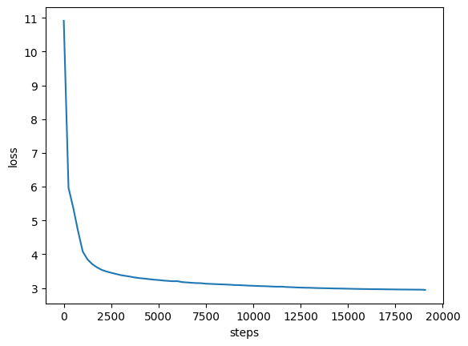

# MicroTransformer (MalyLLM)

A small language model built from scratch in PyTorch, based on SmolLM architecture.
Trained on the FineWeb dataset and published on HuggingFace.

## Architecture

- **Grouped Query Attention (GQA)** with RoPE positional encoding
- **SwiGLU MLP** (gate + up + down projections)
- **RMSNorm** (pre-normalization)
- **Weight tying** between embedding and LM head

| Parameter            | Value  |
|----------------------|--------|
| Vocabulary size      | 49 152 |
| Hidden dim           | 576    |
| Layers               | 30     |
| Attention heads      | 9      |
| KV heads             | 3      |
| Head dim             | 64     |
| Max sequence length  | 2 048  |

## Run Demo
'''bash
pip install requirements_demo.txt
start run_demo.py

Requires CUDA and PyTorch with CUDA 12.6 support.

# Training details
Tokenizer: HuggingFaceTB/SmolLM-135M
Batch size: 524 288 tokens (gradient accumulation)
Max steps: 19 073 (~10B tokens)
Optimizer: AdamW (betas 0.9/0.95, weight decay 0.1)
Learning rate: cosine schedule (6e-4 → 6e-5, 715 warmup steps)
Mixed precision: bfloat16

# Model on HuggingFace
ArekStaron/MalyLLM